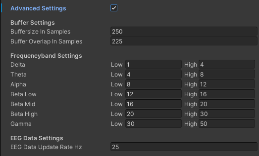
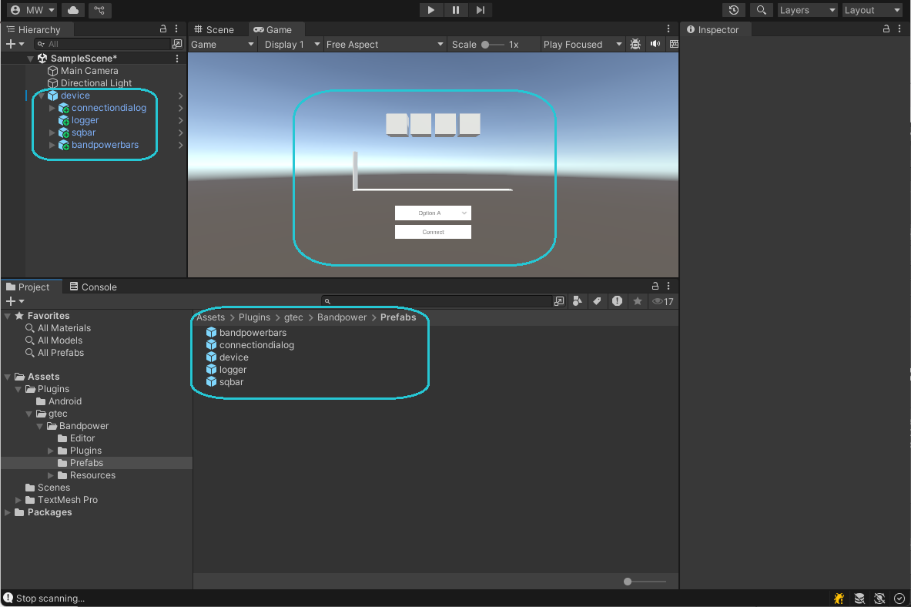

# Unity Bandpower Interface

Unity Bandpower Interface is a seamless Unity plugin designed for developers working with Unicorn BCI Core devices. It enables real-time bandpower calculation, allowing effortless integration of bandpower-based BCI games and applications. With an intuitive setup and optimized performance, this interface empowers developers to create immersive, brain-driven experiences with ease. 

[Prerequisites](#Prerequisites) 
&nbsp;&nbsp;&nbsp;[Hardware Requirements](#hardware-requirements) 
&nbsp;&nbsp;&nbsp;[Development](#development) 
&nbsp;&nbsp;&nbsp;[Deployment](#development) 
[Prefabs](#prefabs) 
&nbsp;&nbsp;&nbsp;[Device](#device) 
&nbsp;&nbsp;&nbsp;[Connection Dialog](#connection-dialog) 
&nbsp;&nbsp;&nbsp;[Logger](#logger) 
&nbsp;&nbsp;&nbsp;[SQ Bar](#sq-bar) 
&nbsp;&nbsp;&nbsp;[Bandpower Bars](#bandpower-bars) 
[Quickstart Guide](#quickstart-guide) 
[Deploy to Windows](#deploy-to-windows) 
[Deploy to macOS](#deploy-to-macos) 
[Deploy to Android](#deploy-to-android) 

# Prerequisites

## Hardware Requirements
- Development: Windows or Mac computer
- Deployment: Windows, Mac or Android device
- Unicorn BCI Core 8
- Bluetooth adapter supporting Bluetooth 5

## Development

### Windows
- Windows 11
- Unity 2022.3.56f1
- NET Framework   .NET Framework 4.8
- Visual Studio  Microsoft Visual Studio 2022

### Mac
- macOS 14.5+
- Unity 2022.3.56f1
- Xcode 15.4
- Command Line Tools for Xcode 15.3
- Visual Studio Code

## Deployment

### Windows
- Windows 11
- NET Framework   .NET Framework 4.8

### Mac
- macOS 14.5+

### Android
- SDK Version 31+

## Prefabs

### Device

 

### Settings

#### Type
- Unicorn BCI Core - Adds Unicorn BCI Core devices to the available devices list
- Simulator - Adds simulator devices to the available devices list
- All Devices - Adds simulator and Unicorn BCI Core devices to the available devices list

It is possible to simulate good, floating or grounded EEG using the simulator devices. It is also possible to simulate alpha activity using the simulator devices.

#### Advanced Settings

 

#### Buffer Settings

It is possible to modify the buffersize and buffer overlap used for bandpower calculation. The output rate of calculated bandpower is affected by changing buffersize and buffer overlap.

$$ f_{bandpower} =  {1 \over {(buffersize - bufferoverlap) \over samplingrate}} $$

#### Frequency Ranges

The Unity Bandpower interface is estimating bandpower for various frequency bands. It is possible to modify the cutoff frequencies of each calculated frequency band in the advanced settings.

#### Bandpower Ratios

The Unity Bandpower interface calculates different bandpower ratios from the defined frequency bands. Available ratios are:

$$ PowerRatioIndex =  {delta + theta \over alpha + beta} $$
$$ DeltaAlphaRatio =  {delta \over alpha} $$
$$ ThetaAlphaRatio =  {theta \over alpha} $$
$$ ThetaBetaRatio =  {theta \over beta} $$
$$ ThetaBetaAlphaRatio =  {theta \over alpha + beta} $$
$$ EngagementIndex =  {beta \over theta + alpha} $$

### Events

The device prefab provides an event system as an interface to unity.

#### OnDevicesAvailable
The event called when devices are discovered. Available devices are provided as list of strings.
 Event data: List&#x003c;string&#x003e;

#### OnDeviceStateChanged
The event called when device state changed. Th current device state is provided as 'State' enum.
 Event data: List&#x003c;State&#x003e;

#### OnPipelineStateChanged
The event called when a signal rocessing pipeline state changed. The current state is provided as string.
 Event data: string

#### OnRuntimeExceptionOccured
The event called when a runtime exception occured. The Exception is provided as 'Exception' object.
 Event data: Exception

#### OnBandpowerAvailable
The event called when bandpower values for each channel individually are available. The frequency of the event is affected by the buffer settings and bandpower ranges set in the [Advanced Settings](#advanced-settings). Data is provided as Dictionary with the frequency band name as Key (delta, theta, alpha, beta-low, beta-mid, beta-hig, gamma) and the bandpower values as double array as value.
 Event data: Dictionary&#x003c;string, double[]&#x003e;

#### OnMeanBandpowerAvailable
The event called when averaged bandpower values over all channels are available. The frequency of the event is affected by the buffer settings and bandpower ranges set in the [Advanced Settings](#advanced-settings). Data is provided as Dictionary with the frequency band name as Key (delta, theta, alpha, beta-low, beta-mid, beta-hig, gamma) and the bandpower value as double value.
 Event data: Dictionary&#x003c;string, double&#x003e;

#### OnRatiosAvailable
The event called when bandpower ratios for each channel individually are available. The frequency of the event is affected by the buffer settings and bandpower ranges set in the [Advanced Settings](#advanced-settings). Data is provided as Dictionary with the bandpower ratio name as Key (PowerRatioIndex, DeltaAlphaRatio, ThetaAlphaRatio, ThetaBetaRatio, ThetaBetaAlphaRatio, EngagementIndex) and the bandpower ratios as double array as value.
 Event data: Dictionary&#x003c;string, double[]&#x003e;

#### OnMeanRatiosAvailable
The event called when averaged bandpower ratios over all channels are available. The frequency of the event is affected by the buffer settings and bandpower ranges set in the [Advanced Settings](#advanced-settings). Data is provided as Dictionary with the bandpower ratio name as Key (PowerRatioIndex, DeltaAlphaRatio, ThetaAlphaRatio, ThetaBetaRatio, ThetaBetaAlphaRatio, EngagementIndex) and the bandpower ratio as double value.
 Event data: Dictionary&#x003c;string, double&#x003e;

#### OnSignalQualityAvailable
The event called when new signal quality values are available.
 Event data: List&#x003c;ChannelStates&#x003e;

#### OnBatteryLevelAvailable
The event called when battery level data is available.
 Event data: float

#### OnDataLost
The event called when data is lost.
 Event data: None

### Connection Dialog

The connection dialog prefab is a very simple pre defined connection dialog featuring a dropdown menu to select devices and a button to connect to a device or disconnect from a device. Drag this object into your scene ans a child object of the [device](#device) object to automatically connect events or connect via the unity event system.

 

### Logger

The logger prefab is a logging module writing messages provided by the [device](#device). Drag this object into your scene ans a child object of the [device](#device) object to automatically connect events or connect via the unity event system.

 

### SQ Bar

The sq bar prefab is a simple module visualizing the eeg signal quality. Drag this object into your scene ans a child object of the [device](#device) object to automatically connect events or connect via the unity event system.

 

### Bandpower Bars

The sq bar prefab is a simple module visualizing the averaged bandpower values. Drag this object into your scene ans a child object of the [device](#device) object to automatically connect events or connect via the unity event system.

 

## Quickstart Guide

1. Open Unity Hub on your Windows or Mac

2. Create a new Unity Project

 

4. Import the Unity Bandpower Interface unity package. 
Click Assets -> Import Package -> Custom Package... -> load .unitypackage 
Ensure that all items are selected and click 'Import'.

 

5. Open Assets -> Plugins -> gtec -> Bandpower -> Prefabs.

6. Drag the [device](#device) prefab into your scene.

7. Drag the [connection dialog](#connection-dialog) prefab into your scene.

8. Drag the [logger](#logger) prefab into your scene.

9. Drag the [sq bar](#sq-bar) prefab into your scene.

10. Drag the [bandpower bars](#bandpower-bars) prefab into your scene.

 

11. Set the 'Type' setting is set to 'Unicorn BCI Core' or 'All Devices'

12. Turn your Unicorn BCI Core device on

13. Click the Play Button in the Unity Editor

 

14. Wait until the device is discovered and click 'Connect'

15. The bandpower bars should start moving and the signal quality bar should start changing colors

## Deploy to Windows

1. Select 'Windows' as Target Platform.
2. Select target architecture
3. Click 'Build'

 

**Note:** 
An Windows device is required to build for Windows

## Deploy to macOS

1. Select 'macOS' as Target Platform.
2. Select target architecture
3. Click 'Build'

 

**Note:** 
A mac device is required to build for macOS

## Deploy to Android

1. Select 'Android' as Target Platform.
2. Select target architecture
3. Click 'Build'

 

**Note:** 
An Android device is required to build for Android